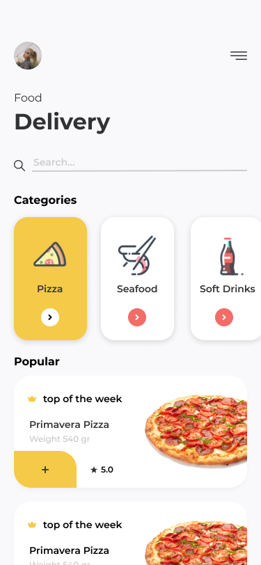
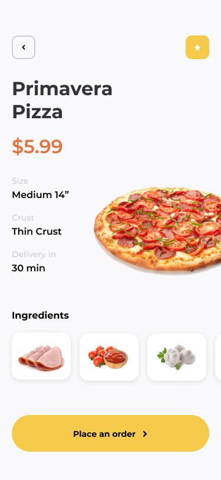

# 🍕 Food Delivery App

[](https://expo.dev/)
[](https://reactnative.dev/)
[]()
[](https://redux-toolkit.js.org/)
[](https://www.typescriptlang.org/)

A professional, production-ready food delivery application built with **React Native (Expo)** focusing on **Clean Architecture**, **SOLID principles**, and a premium User Experience.

## 📱 Preview

<p align="center">
  
  
  
</p>

## 🚀 Key Features

### 🛒 Complete Order Workflow
- **Advanced Cart System**: Real-time subtotal calculation, delivery fee logic, and dynamic quantity management.
- **Persistence-Ready State**: Managed via Redux Toolkit with centralized business logic in Domain Use Cases.
- **Haptic Feedback**: Integrated `expo-haptics` for tactile engagement during "Add to Cart" and successful checkouts.
- **Order Success Flow**: High-quality success screen with entry animations and delivery progress tracking.

### 🍱 Premium UI/UX
- **Modern Design System**: Glassmorphism elements, sleek dark-mode-ready colors, and tailored typography (Inter/Outfit).
- **Smooth Transitions**: Fluid navigation between product catalogues and detailed views using Expo Router.
- **Interactive Elements**: Custom animated buttons, category filtering with active states, and search functionality.

### 🌐 Live Data Integration
- **Hybrid Data Source**: Combines local high-resolution UI assets with live remote recipes fetched from DummyJSON API via Axios.
- **Fail-safe Design**: Automatic fallback to seeded local data in case of network failures, ensuring zero downtime for users.

## 🏗️ Architecture (Clean & SOLID)

The project is structured according to **Clean Architecture** principles to separate concerns and ensure maintainability:

- **📁 src/domain**: The heart of the app. Contains pure business logic, `Entities` (Cart, Order, Menu), and `UseCases` (ManageCart, CreateOrder). Zero dependencies on external libraries or UI.
- **📁 src/data**: Handles data retrieval. Contains `Repositories` and `DataSources` (API clients, Local seeds). It implements the interfaces defined in the domain layer.
- **📁 src/presentation**: The UI layer. Organized into `components`, `state` (Redux slices), and `hooks`. 
- **📁 src/app**: Centralized routing using **Expo Router**, mapping URLs to the presentation screens.

## 🛠️ Tech Stack

- **Framework**: Expo (SDK 52+) / React Native
- **Navigation**: Expo Router (File-based routing)
- **State Management**: Redux Toolkit (Slices, Memoized Selectors)
- **Networking**: Axios
- **Animation**: React Native Reanimated / Animated API
- **Feedback**: Expo Haptics
- **Styling**: Vanilla StyleSheet (Flexbox)

## 📁 Project Structure

```text
src/
├── app/                  # Expo Router navigation (Routes)
├── domain/               # Core Business Logic (Entities & UseCases)
├── data/                 # Data implementation (Repositories & Seeds)
├── presentation/         # UI Layer
│   ├── components/       # Reusable UI Blocks (Atomic Design)
│   └── state/            # Redux Store, Slices & Hooks
├── constants/            # Design system tokens and assets
└── assets/               # Branding and visuals
```

## 🏁 Getting Started

### 1. Install dependencies
```bash
npm install
```

### 2. Start the development server
```bash
npx expo start
```

## 📜 Validation

The project adheres to strict coding standards:
- ✅ **100% Type-Safe**: No implicit `any` usage.
- ✅ **Linted**: Consistent code formatting.
- ✅ **Architecture Validated**: Decoupled business logic from UI.

## 👤 Author

Developed with a focus on modern mobile architecture patterns and high-performance state management for a professional portfolio.
